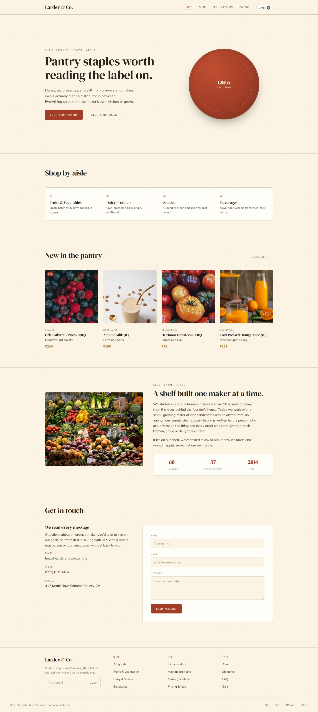
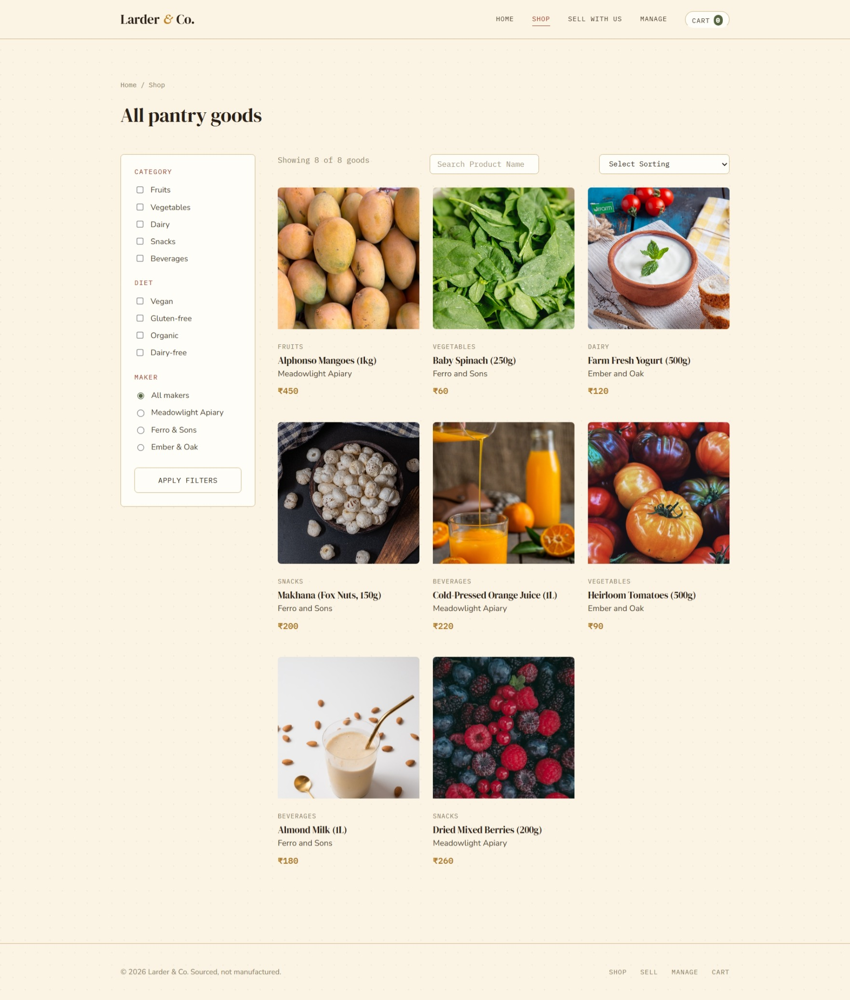
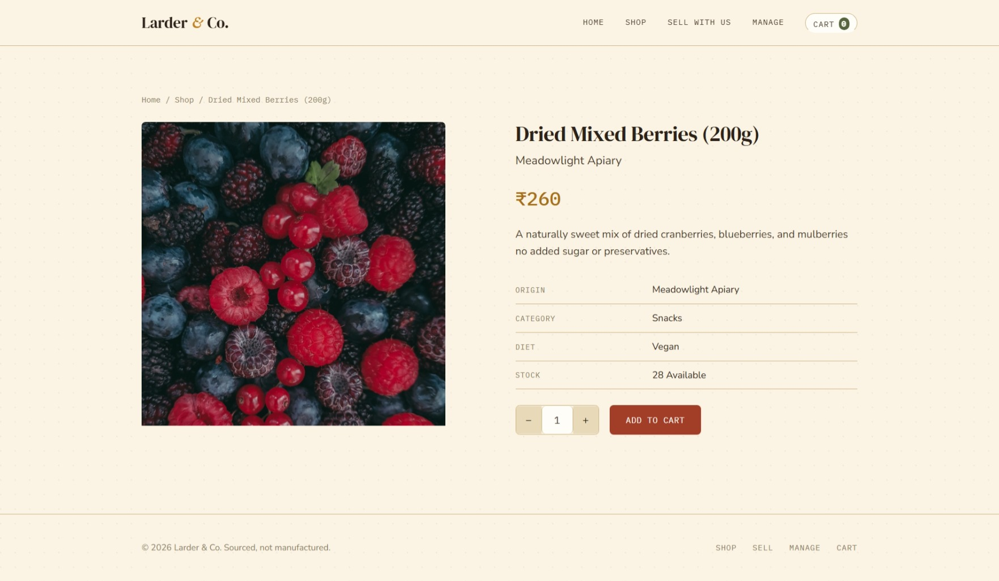
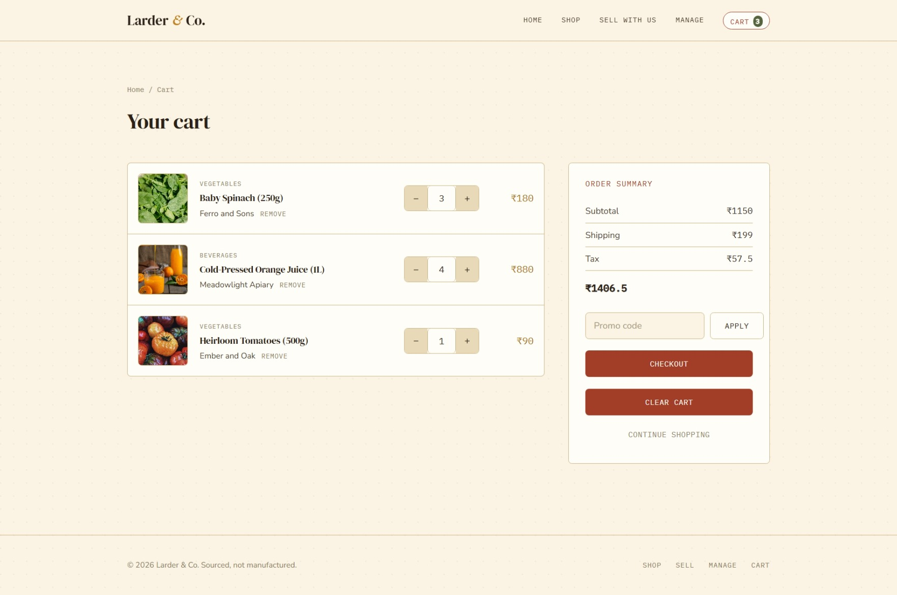
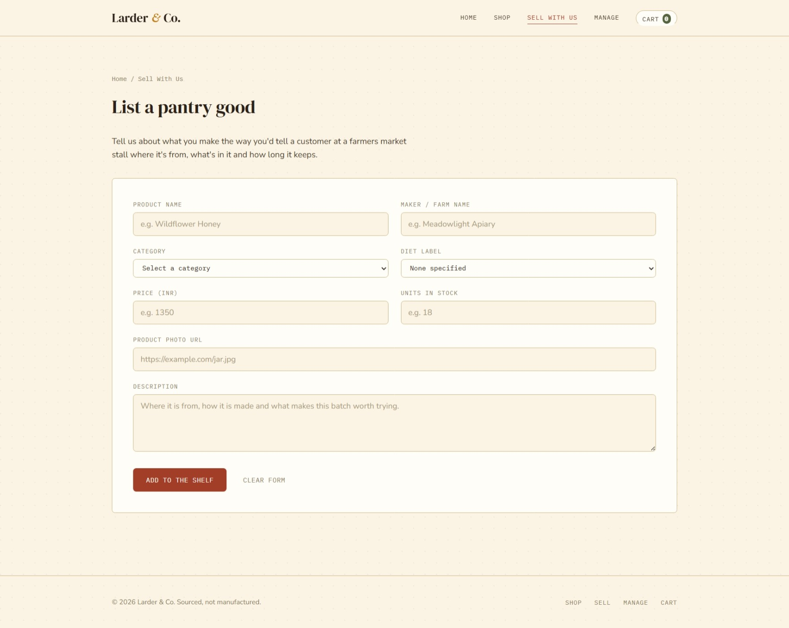
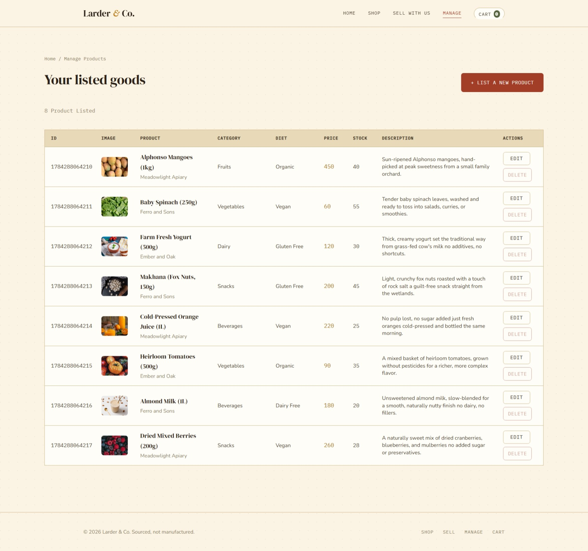

<div align="center">

# Project : Grocery Store Inventory System — E-Commerce Website

**A simple and interactive JavaScript application that lets a shopper browse, filter, search, sort and buy pantry goods, while also letting a seller add, edit, and delete their own product listings. All built with HTML, CSS and JavaScript, using the browser's local storage as the data layer.**

</div>

---

## 📑 Table of Contents

- [Project Description](#-project-description)
- [How This Project is Made](#-how-this-project-is-made)
- [Features](#-features)
- [Technologies Used](#-technologies-used)
- [JavaScript Concepts Covered](#-javascript-concepts-covered)
- [How It Works](#-how-it-works)
- [Project Structure](#-project-structure)
- [Screenshot](#-screenshot)
- [Demo](#-demo)
- [Author](#-author)

---

## 📌 Project Description

Larder & Co. is an e-commerce project built using **HTML**, **CSS** and **JavaScript**. It covers the full flow of a small online shop: a home page showcasing the newest goods, a shop page where every product can be filtered, searched and sorted, a single product page with a quantity stepper, a cart page with live totals and a seller side where products can be listed, edited and removed.

This project is designed to strengthen JavaScript fundamentals through a practical, end to end build: reading and writing arrays of objects to local storage, keeping several pages in sync with the same stored data and building dynamic tables and grids purely with DOM manipulation.

---

## 🚀 How This Project is Made

This project is built using HTML, CSS and JavaScript to create a working **E-Commerce Website**.

### 🧱 HTML Structure

- Each page is a separate HTML file sharing the same header, navigation and footer markup.
- The **Index page** holds a hero section, category aisles, a newest products grid, an about section and a contact form.
- The **Add Product page** holds a single form with fields for product name, maker name, category (dropdown), diet label (dropdown), price, stock, image URL and description, followed by a submit button and a reset button. A hidden success message block sits right below the form and swaps in after a successful submit.
- The **Shop page** holds a filters sidebar (category, diet, maker) and a results grid with a search box and a sort dropdown.
- The **Single product page** and the **Manage products** page start as empty containers and are filled entirely by JavaScript once the page loads.
- The **Cart page** holds an empty list container and an order summary card with subtotal, shipping, tax and total rows.

### 🎨 CSS Styling
- A warm, kraft paper inspired theme is built using CSS custom properties for color, font, radius and spacing.
- Flexbox and CSS grid are used throughout for the product grid, filters layout, cart rows and the manage products table.
- A responsive design adapts the navigation, filters, cart rows and the manage products table into a stacked card layout on small screens, along with a collapsible filter panel built with a pure CSS checkbox toggle.
- Small entrance animations (like the stamped wax seal on the home page) add a bit of personality to the interface.

### ⚙️ JavaScript Functionality
- Every product is stored as an object with an unique id, name, maker, category, diet, price, stock, image and description, kept together in one array in local storage.
- Arrow functions, template literals and array methods such as `map`, `filter`, `forEach`, and `sort` are used throughout for cleaner, more readable code.
- `localStorage.getItem()` and `localStorage.setItem()` keep the product catalog and the cart in sync across every page, so a product added, edited or removed on one page reflects everywhere else.
- The URL query string (`URLSearchParams`) is used to pass which product to edit or which product to view between pages.
- DOM manipulation dynamically builds the product grid, the single product page, the manage products table and every row inside the cart.
- Event listeners handle form submissions, filter and sort changes, live search input and every button click for editing, deleting and adjusting quantity.

---

## ✨ Features

- Add Product
- View Product
- Delete Product
- Edit Product
- Single Page View
- Add to Cart
- Increase Qty
- Decrease Qty
- Total
- Sub Total
- Remove Product
- Search
- Filter Data
- Sorting

---

## 🔧 Technologies Used

- HTML5
- CSS3
- JavaScript (ES6)
- Browser Local Storage

---

## 📚 JavaScript Concepts Covered

- Arrays of objects
- Loops (`for`, `forEach`)
- Functions
- Arrow Functions
- Template Literals
- DOM Manipulation
- Event Listeners
- Conditional Statements
- Array Methods (`map`, `filter`, `some`, `sort`, `splice`)
- localStorage (`getItem`, `setItem`, `removeItem`)
- URLSearchParams

---

## 🔄 How It Works

### 🏠 Index Page
- Shows a hero banner, four category aisles and a grid of the newest products pulled straight from the stored product list.
- Seeds a small set of starter products into local storage the very first time the site is opened.

### ➕ Add Product Page
- A single form is used both for adding a brand new product and for editing one that already exists, switching modes based on an id present in the URL.
- On submit, the product is either pushed onto the stored product list or spliced in place of the one being edited and any matching cart entry is updated to match.

### 🛍️ View Product Page
- Displays every product as a card in a responsive grid.
- A filters sidebar narrows results by category, diet and maker, a search box filters live by product name and a sort dropdown reorders by newest, price or maker name.

### 📦 Single Product View Page
- Shows one product full detail view with its image, price, description and a quantity stepper.
- Adds the chosen product and quantity to the cart, respecting available stock and a maximum quantity per item.

### 🗂️ Manage Products Page
- Lists every product the seller has listed in a table, with columns for unique id, image, name, category, diet, price, stock and description.
- Edit links back into the Add Product page in edit mode and a delete button removes the product after a confirmation prompt.

### 🛒 Cart Page
- Rebuilds the entire cart list from local storage every time it loads, dropping any item whose product has since been deleted.
- Quantity stepper buttons increase or decrease each line, recalculating that line's total instantly.
- An order summary calculates subtotal, shipping, tax and the final total, and updates the moment anything in the cart changes.
- A clear cart button empties the cart in one action after a confirmation prompt.

---

## 📂 Project Structure

```text
grocery-store-inventory-system/
│
├── assets/
│   ├── css/
│   |   └── style.css
|   |
|   └── output/
|       ├── index-page.jpeg
│       ├── view-product-page.jpeg
|       ├── single-product-view-page.jpeg
|       ├── cart-page.jpeg
|       ├── add-product-page.jpeg
|       └── manage-product-page.jpeg
|
├── index.html
├── add-product.html
├── view-product.html
├── product.html
├── manage-products.html
├── cart.html
└── README.md
```

---

## 📸 Screenshot

### Index Page


### View Product Page


### Single Product View Page


### Cart Page


### Add Product Page


### Manage Product Page


---

## 🎬 Demo

| | |
|---|---|
| 🔗 Live Demo                 | [Grocery Store Inventory System](https://grocery-store-inventory-system.netlify.app/) |
| 🎥 Project Explanation Video | Add your video link here |
| 🎥 Project Recording | Add your recording link here |

---

## 💻 Author

<div align="center">

**Sakina Sendhi**

[](https://github.com/sakinasendhi52)

⭐ Thank you for visiting this repository!

</div>
